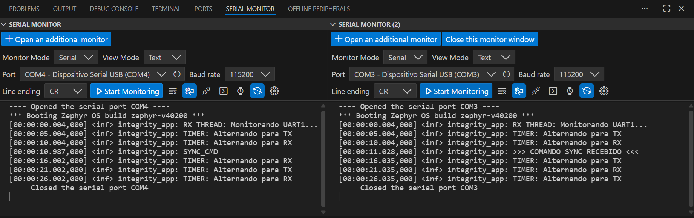
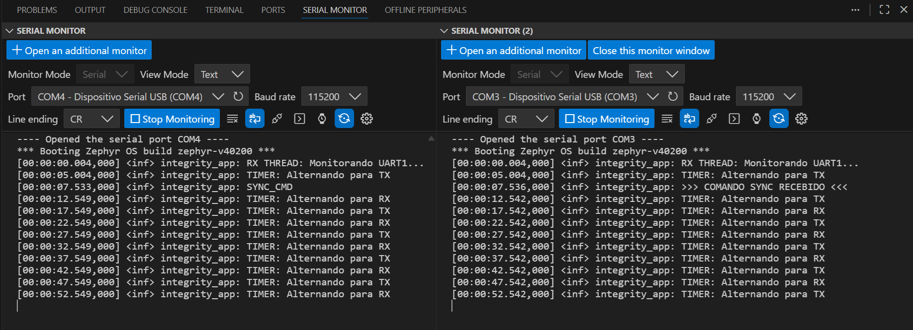
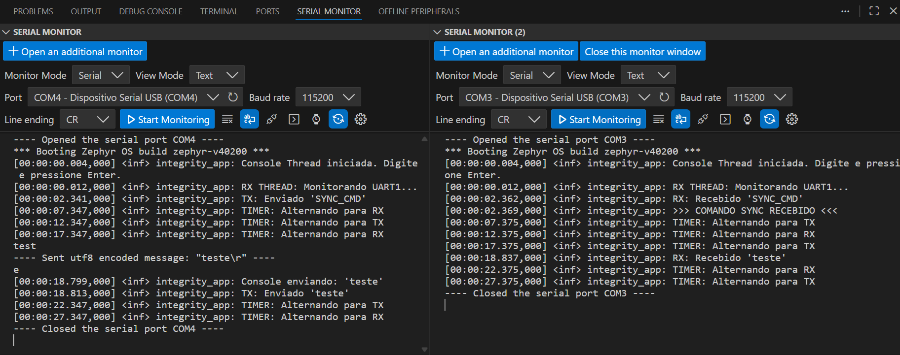
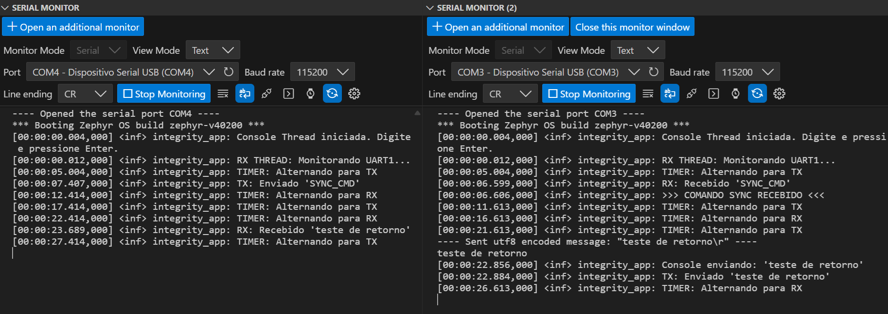

# PSI-Microcontroladores2-Aula12
Atividade: Sincronismo, Detecção de Colisão e Integridade

## Introdução

Na atividade anterior, vocês desenvolveram um código de comunicação serial que utiliza filas e interrupção para operar em dois modos: recepção por 5 segundos e transmissão por 5 segundos.

Nesta atividade, o objetivo é realizar em duplas a comunicação entre duas placas e refinar o protocolo de comunicação com sincronismo, detecção de colisão e verificação de integridade.

_Lembrete_: o código-base para a atividade anterior está disponível em: https://github.com/zephyrproject-rtos/zephyr/tree/main/samples/drivers/uart/echo_bot

## Etapa 1: Modelagem e Planejamento de Testes

Considerando o cenário proposto de comunicação entre duas placas com modo de operação simples de 5 segundos para transmitir e 5 segundos para receber, é natural que ocorram problemas de sincronismo: uma placa pode acabar transmitindo enquanto a outra está transmitindo também, e mesmo no recebimento podemos não receber a mensagem completa.

### 1.1. Sincronismo por Botão

#### Diagrama

---
#### Caso de Teste

    CT-01: Inicialização e Alternância Automática

    Objetivo: Verificar se o timer interno está controlando os estados TX/RX.

    Ação: Ligar as duas placas e não pressionar nada.

    Observação Visual: Observar os LEDs das placas e as mensagens no terminal por 15 segundos.

    Resultado Esperado:

    O terminal imprime --- [MODO TX] --- ou --- [MODO RX] --- a cada 5 segundos.

    Os LEDs alternam entre Verde (TX) e Azul (RX).

    Critério de Aceite: A alternância ocorre periodicamente e de forma contínua.

---

    CT-02: Sincronismo Forçado por Botão (Master Trigger)

    Objetivo: Verificar se o botão reseta o ciclo e alinha as duas placas (Mestre/Escravo).

    Pré-condição: As placas podem estar desalinhadas (ambas em TX ou ambas em RX).

    Ação: Pressionar o botão SW0 na Placa A.

    Resultado Esperado:

    Placa A (Mestre): O terminal exibe [BTN] Botao detectado!, força imediatamente o modo para TX (LED Verde) e envia o pacote SYNC_BTN.

    Placa B (Escravo): O terminal exibe [RX RECEBIDO]: SYNC_BTN seguido de >>> SYNC RECONHECIDO! <<<. O LED muda para RX (Azul) e reinicia seu timer interno.

    Critério de Aceite: Após o botão ser pressionado, a Placa A deve estar transmitindo e a Placa B escutando, garantindo o alinhamento do ciclo TDM.

### 1.2. Detecção de Colisão

#### Diagrama

---
#### Caso de Teste

    CT-01: Digitação em Modo de Escuta (Teste de Fila)

    Objetivo: Verificar se o sistema impede o envio imediato durante o modo RX e armazena a mensagem para depois.

    Pré-condição: Aguardar a Placa A entrar em Modo RX (LED Azul / Terminal: [RX ATIVO]).

    Ação: Digitar "Teste Fila" e pressionar Enter enquanto ainda estiver no modo RX.

    Resultado Esperado:

    A mensagem NÃO deve aparecer no terminal da Placa B imediatamente.

    O terminal da Placa A deve exibir: [Agendado] 'Teste Fila'.

    Ação Secundária: Aguardar a troca automática para Modo TX (LED Verde).

    Resultado Final:

    Assim que entrar em TX, a Placa A exibe: [TX Enviando]: Teste Fila.

    A Placa B recebe a mensagem imediatamente.

    Critério de Aceite: A transmissão física só ocorre quando o LED está Verde (TX), garantindo que o canal estava reservado para aquela placa.

### 1.3. Verificação de Integridade

#### Diagrama

---
#### Caso de Teste

    CT-01: Transmissão de Pacote Íntegro

    Objetivo: Verificar se o cálculo de Checksum e o empacotamento estão corretos.

    Ação: Na Placa A (durante modo TX), digitar "Ola" e dar Enter.

    Processamento Interno (Caixa Branca): O sistema calcula Header (0x7E) + Len (3) + Payload ("Ola") + Checksum.

    Resultado Esperado:

    A Placa B recebe os bytes.

    A thread de RX calcula o checksum localmente.

    O terminal da Placa B exibe: [RX RECEBIDO]: Ola.

    Critério de Aceite: A mensagem aparece limpa no receptor, sem caracteres de lixo.

## Etapa 2: Desenvolvimento Orientado a Testes

### 2.1. Sincronismo por Botão

A imagem a seguir demonstra um exemplo de funcionamento implementado para o sincronismo por meio do botão. Note que antes as duas placas estavam em RX. A seguir, ao pressionar o botão um comando de sincronismo é enviado dando inicio a uma rotina de mudança de status afim de que uma esteja em RX e outra em TX.

### 2.2. Detecção de Colisão

Afim de evitar qualquer colisão seguiu-se o protocolo mestre-escravo. Sendo assim: só o mestre envia comandos de sincronismo, pelo sincronimso, nunca as duas placas falam ao mesmo tempo, de modo que há zero colisões possíveis.

### 2.3. Verificação de Integridade

As imagens a seguir são prints de LOGs provando a integridade do código e seu funcionamento.

 
 
